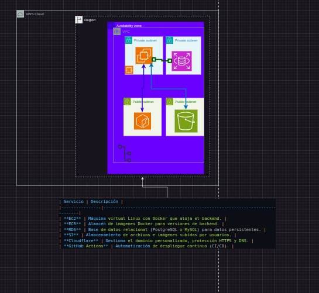

<p align="center">
  <a href="http://nestjs.com/" target="blank"></a>
</p>

<h1 align="center">E-commerce Backend con NestJS</h1>

<p align="center">
  Proyecto backend desarrollado con el framework <a href="https://nestjs.com" target="_blank">NestJS</a>, basado en una arquitectura hexagonal, con despliegue en AWS y funcionalidades completas para el manejo de productos, pagos e integración con servicios externos.
</p>

---

## 🧠 Descripción del proyecto

Este proyecto representa el backend completo de una tienda en línea (e-commerce), construido con **NestJS** y **TypeScript**. Su diseño sigue una arquitectura **hexagonal (Ports & Adapters)**, permitiendo alta escalabilidad, independencia de frameworks y facilidad de pruebas unitarias.

El backend cuenta con:

- Módulo de productos y categorías
- Gestión de usuarios y autenticación
- Integración con pasarela de pagos **Wompi**
- Gestión de imágenes con **Amazon S3**
- Base de datos persistente con **RDS**
- Despliegue automatizado en **AWS EC2** usando contenedores Docker
- Publicación de imágenes Docker en **Amazon ECR**
- Documentación de API con **Swagger**

---

## 🧱 Arquitectura Hexagonal

El proyecto sigue el patrón hexagonal para desacoplar la lógica de negocio de los detalles técnicos como bases de datos, controladores HTTP o servicios externos. Esto se traduce en tres capas principales:

### 1. **Dominio**

- Entidades, lógica de negocio pura.
- Interfaces (ports) que definen comportamientos requeridos por el dominio.
- Totalmente agnóstico al framework (NestJS).

### 2. **Aplicación**

- Casos de uso o servicios que orquestan la lógica del dominio.
- Utiliza los ports para comunicarse con el exterior.

### 3. **Infraestructura**

- Adaptadores que implementan los ports.
- Controladores HTTP, repositorios, integraciones con Wompi, Amazon S3, etc.

Esta separación mejora:

- La mantenibilidad
- El testing
- La independencia del framework y de la base de datos

---

## 🛠️ Patrones y buenas prácticas

- **Dependency Injection** mediante los módulos de NestJS.
- **Repository Pattern** para desacoplar acceso a datos.
- **DTOs (Data Transfer Objects)** para validaciones con `class-validator`.
- **Pipes** para transformación y validación.
- **Modularización del código** en `@Modules` claros y separados.

---

---

## 🐳 Uso con Docker

Este proyecto incluye configuración para ejecutar el backend con Docker en cualquier entorno.

### 📁 Estructura relevante

- `Dockerfile`: define cómo se construye la imagen de producción.
- `docker-compose.yml`: permite levantar servicios (app, base de datos, etc).
- `.env.production`: archivo con variables de entorno para producción (no se sube al repo).

### 🔧 Comandos útiles

```bash
# Construir imagen Docker
docker build -t ecommerce-backend .

# Ejecutar contenedor
docker run -d --name app -p 3000:3000 --env-file .env.production ecommerce-backend

# Usar docker-compose (recomendado)
docker-compose up -d --build


## ☁️ Infraestructura en AWS

| Servicio       | Descripción                                                                 |
|----------------|------------------------------------------------------------------------------|
| **EC2**        | Máquina virtual Linux con Docker que aloja el backend.                      |
| **ECR**        | Almacén de imágenes Docker para versiones de backend.                       |
| **RDS**        | Base de datos relacional (PostgreSQL o MySQL) para datos persistentes.      |
| **S3**         | Almacenamiento de archivos e imágenes subidas por usuarios.                 |
| **Cloudflare** | Gestiona el dominio personalizado, protección HTTPS y DNS.                  |
| **GitHub Actions** | Automatización de despliegue continuo (CI/CD).                         |


---


## 🧪 Swagger para documentación

La API cuenta con documentación automática generada con Swagger, accesible en:

```
http://localhost:3000/api
